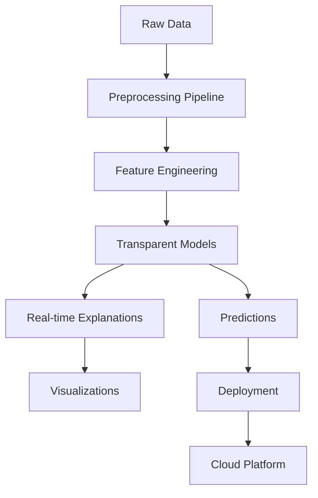

# About Xplainable

:::info What is Xplainable?
**Xplainable** is a transparent machine learning package that provides real-time explainability without sacrificing performance. It bridges the gap between accuracy and interpretability through novel algorithms designed specifically for complete transparency.
:::

## Overview

Xplainable is a Python package that leverages explainable machine learning for fully transparent machine learning and advanced data optimization in production systems. Unlike traditional black-box models, xplainable provides **real-time explainability** without needing surrogate models like SHAP or LIME.

### Key Features

<div className="row">
  <div className="col col--6">
    <div className="card">
      <div className="card__header">
        <h3>🔍 Real-time Explainability</h3>
      </div>
      <div className="card__body">
        <p>
          Get instant explanations without fitting surrogate models. Our transparent algorithms provide explanations as part of the prediction process.
        </p>
      </div>
    </div>
  </div>
  <div className="col col--6">
    <div className="card">
      <div className="card__header">
        <h3>⚡ Rapid Refitting</h3>
      </div>
      <div className="card__body">
        <p>
          Update model parameters on-the-fly, even for individual features. Fine-tune your models without complete retraining.
        </p>
      </div>
    </div>
  </div>
</div>

<div className="row">
  <div className="col col--6">
    <div className="card">
      <div className="card__header">
        <h3>🎯 Dual Interface</h3>
      </div>
      <div className="card__body">
        <p>
          Use either programmatic Python APIs or interactive Jupyter GUIs. Perfect for both data scientists and business users.
        </p>
      </div>
    </div>
  </div>
  <div className="col col--6">
    <div className="card">
      <div className="card__header">
        <h3>☁️ Cloud Integration</h3>
      </div>
      <div className="card__body">
        <p>
          Deploy models to production in seconds with Xplainable Cloud. Full collaboration and model management features.
        </p>
      </div>
    </div>
  </div>
</div>

## Core Capabilities

Xplainable provides a comprehensive suite of tools for the entire machine learning lifecycle:

### 📊 **Data Preprocessing**
- Comprehensive preprocessing pipeline with 15+ transformers
- Data quality scanning and health checks
- Feature engineering and transformation
- Pipeline persistence and reusability

### 🤖 **Model Training**
- **XClassifier**: Transparent binary classification
- **XRegressor**: Transparent regression
- **Partitioned Models**: Multi-segment modeling
- **Surrogate Models**: Explain black-box models

### 🔧 **Hyperparameter Optimization**
- Bayesian optimization with Hyperopt
- Evolutionary algorithms
- Cross-validation with early stopping
- Custom search spaces

### 📈 **Visualization & Explainability**
- Global, regional, and local explanations
- Feature importance analysis
- Waterfall plots and decision trees
- Real-time model insights

### 🚀 **Deployment**
- One-click API deployments
- Model versioning and management
- A/B testing capabilities
- Production monitoring

## Why Choose Xplainable?

:::tip The Transparency Advantage
Traditional ML requires choosing between **accuracy** and **explainability**. Xplainable eliminates this trade-off by providing transparent algorithms that match the performance of black-box models while maintaining complete interpretability.
:::

### Performance Without Compromise

| Feature | Traditional ML | Xplainable |
|---------|---------------|------------|
| **Accuracy** | ✅ High | ✅ High |
| **Explainability** | ❌ Post-hoc only | ✅ Real-time |
| **Speed** | ⚡ Fast training | ⚡ Fast + rapid refitting |
| **Deployment** | 🔧 Complex | 🚀 One-click |
| **Collaboration** | 📝 Code-only | 👥 GUI + API |

### Novel Algorithms

Xplainable introduces several breakthrough concepts:

1. **Feature-wise Ensemble**: Each feature gets its own decision tree, optimized for information gain
2. **Rapid Refitting**: Update parameters without full retraining
3. **Transparent Architecture**: No black-box components
4. **Real-time Explanations**: Explanations are part of the prediction process

## Who Uses Xplainable?

### 👨‍💼 **Business Users**
- Domain experts who need to understand model decisions
- Managers requiring transparent AI for compliance
- Analysts building interpretable models

### 👩‍💻 **Data Scientists**
- ML engineers seeking explainable alternatives to XGBoost/LightGBM
- Researchers working on interpretable AI
- Teams requiring rapid model iteration

### 🏢 **Organizations**
- Financial services (regulatory compliance)
- Healthcare (clinical decision support)
- Manufacturing (process optimization)
- Any industry requiring AI transparency

## Getting Started

:::note Ready to Start?
Jump to our [Installation Guide](./installation.md) to get xplainable up and running in minutes, or explore our [Python API documentation](../python-api/classification-binary.md) for detailed examples.
:::

### Quick Example

```python
import xplainable as xp
from xplainable.core.models import XClassifier

# Load data
data = xp.load_dataset('titanic')
X, y = data.drop('Survived', axis=1), data['Survived']

# Train transparent model
model = XClassifier()
model.fit(X, y)

# Get real-time explanations
model.explain()  # No surrogate models needed!
```

## Architecture Overview



## Community & Support

- **Documentation**: Comprehensive guides and API reference
- **Examples**: Real-world use cases and tutorials
- **Community**: Active user community and support
- **Enterprise**: Professional support and custom solutions

:::info Learn More
Explore our [tutorials](../tutorials/) for hands-on examples, or dive into the [Python API](../python-api/) documentation for detailed technical information.
:::
