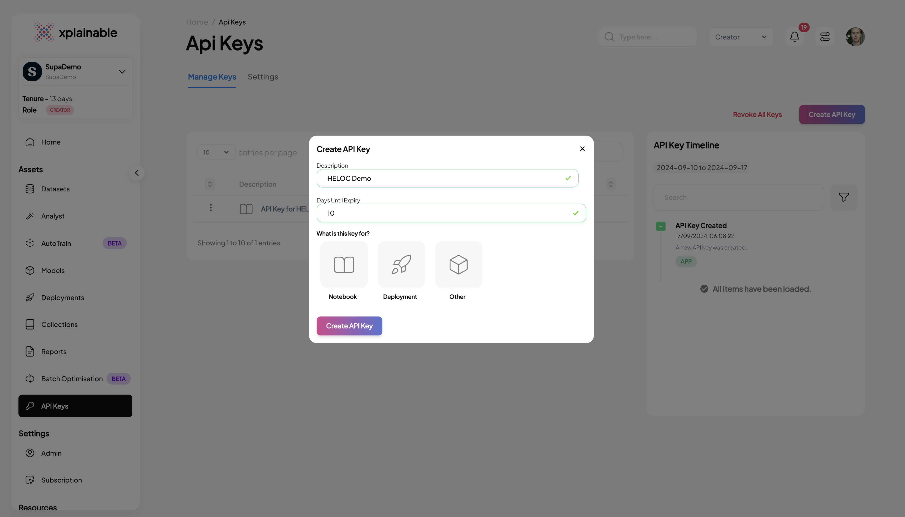
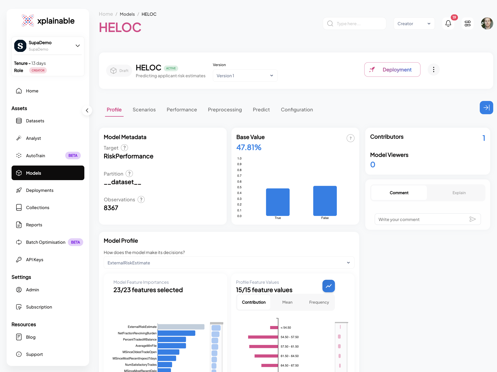
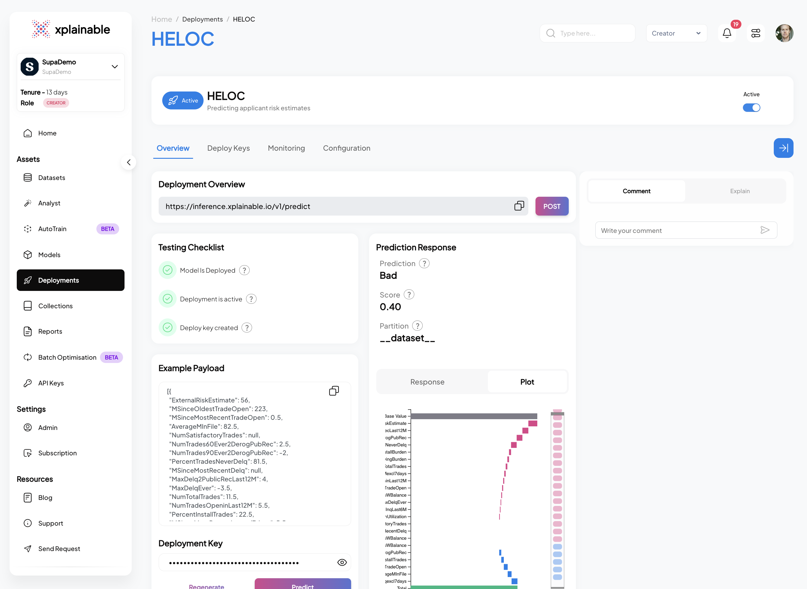

import LinkButtons from "../../src/components/LinkButtons.jsx";
import CellOutput from "../../src/components/CellOutput.jsx";

<LinkButtons
  githubUrl="https://github.com/xplainable/xplainable/blob/main/examples/heloc_credit_risk.ipynb"
  colabUrl="https://colab.research.google.com/github/xplainable/xplainable/blob/main/examples"
/>

# FICO Explainable ML: HELOC


## Introduction

In this walkthrough, we'll use Xplainable's platform to analyze the FICO Home Equity
Line of Credit (HELOC) dataset. This dataset is commonly used to predict credit risk,
helping to identify borrowers who may be at risk of defaulting on their line of credit.

We'll go step-by-step through Xplainable's features, starting with data preprocessing,
moving on to model training, and finally, interpreting the results. The goal is to show
how Xplainable can simplify the process of building and understanding machine learning
models, providing clear insights without the need for complex coding or deep statistical
knowledge. By the end of this walkthrough, you'll see how Xplainable can help you
quickly draw meaningful conclusions from the FICO HELOC dataset.


# Install and import relevant packages


```python
!pip install xplainable
!pip install altair==5.4.1 #Upgrade this to work in Google Colab
!pip install xplainable-client
!pip install kaggle
```

<CellOutput>
{`Requirement already satisfied: xplainable in /Users/jtuppack/miniforge3/envs/xplainable-dev/lib/python3.10/site-packages (1.2.4)
Requirement already satisfied: hyperopt>=0.2.7 in /Users/jtuppack/miniforge3/envs/xplainable-dev/lib/python3.10/site-packages (from xplainable) (0.2.7)
Requirement already satisfied: numba>=0.56.4 in /Users/jtuppack/miniforge3/envs/xplainable-dev/lib/python3.10/site-packages (from xplainable) (0.58.1)
Requirement already satisfied: numpy>=1.26 in /Users/jtuppack/miniforge3/envs/xplainable-dev/lib/python3.10/site-packages (from xplainable) (1.26.4)
Requirement already satisfied: pandas>=1.5.2 in /Users/jtuppack/miniforge3/envs/xplainable-dev/lib/python3.10/site-packages (from xplainable) (1.5.3)
Requirement already satisfied: pyperclip>=1.8.2 in /Users/jtuppack/miniforge3/envs/xplainable-dev/lib/python3.10/site-packages (from xplainable) (1.8.2)
Requirement already satisfied: scikit-learn>=1.2.2 in /Users/jtuppack/miniforge3/envs/xplainable-dev/lib/python3.10/site-packages (from xplainable) (1.3.2)
Requirement already satisfied: scipy>=1.6.2 in /Users/jtuppack/miniforge3/envs/xplainable-dev/lib/python3.10/site-packages (from xplainable) (1.11.4)
Requirement already satisfied: urllib3>=1.26.5 in /Users/jtuppack/miniforge3/envs/xplainable-dev/lib/python3.10/site-packages (from xplainable) (2.1.0)
Requirement already satisfied: psutil>=5.9.4 in /Users/jtuppack/miniforge3/envs/xplainable-dev/lib/python3.10/site-packages (from xplainable) (5.9.6)
Requirement already satisfied: joblib>=1.2.0 in /Users/jtuppack/miniforge3/envs/xplainable-dev/lib/python3.10/site-packages (from xplainable) (1.3.2)
Requirement already satisfied: networkx>=2.6.3 in /Users/jtuppack/miniforge3/envs/xplainable-dev/lib/python3.10/site-packages (from xplainable) (3.2.1)
Requirement already satisfied: tqdm>=4.62.3 in /Users/jtuppack/miniforge3/envs/xplainable-dev/lib/python3.10/site-packages (from xplainable) (4.66.1)
Requirement already satisfied: ipython in /Users/jtuppack/miniforge3/envs/xplainable-dev/lib/python3.10/site-packages (from xplainable) (8.18.1)
Requirement already satisfied: packaging in /Users/jtuppack/miniforge3/envs/xplainable-dev/lib/python3.10/site-packages (from xplainable) (23.2)
Requirement already satisfied: requests in /Users/jtuppack/miniforge3/envs/xplainable-dev/lib/python3.10/site-packages (from xplainable) (2.31.0)
Requirement already satisfied: six in /Users/jtuppack/miniforge3/envs/xplainable-dev/lib/python3.10/site-packages (from hyperopt>=0.2.7->xplainable) (1.16.0)
Requirement already satisfied: future in /Users/jtuppack/miniforge3/envs/xplainable-dev/lib/python3.10/site-packages (from hyperopt>=0.2.7->xplainable) (0.18.3)
Requirement already satisfied: cloudpickle in /Users/jtuppack/miniforge3/envs/xplainable-dev/lib/python3.10/site-packages (from hyperopt>=0.2.7->xplainable) (3.0.0)
Requirement already satisfied: py4j in /Users/jtuppack/miniforge3/envs/xplainable-dev/lib/python3.10/site-packages (from hyperopt>=0.2.7->xplainable) (0.10.9.7)
Requirement already satisfied: llvmlite<0.42,>=0.41.0dev0 in /Users/jtuppack/miniforge3/envs/xplainable-dev/lib/python3.10/site-packages (from numba>=0.56.4->xplainable) (0.41.1)
Requirement already satisfied: python-dateutil>=2.8.1 in /Users/jtuppack/miniforge3/envs/xplainable-dev/lib/python3.10/site-packages (from pandas>=1.5.2->xplainable) (2.8.2)
Requirement already satisfied: pytz>=2020.1 in /Users/jtuppack/miniforge3/envs/xplainable-dev/lib/python3.10/site-packages (from pandas>=1.5.2->xplainable) (2023.3.post1)
Requirement already satisfied: threadpoolctl>=2.0.0 in /Users/jtuppack/miniforge3/envs/xplainable-dev/lib/python3.10/site-packages (from scikit-learn>=1.2.2->xplainable) (3.2.0)
Requirement already satisfied: decorator in /Users/jtuppack/miniforge3/envs/xplainable-dev/lib/python3.10/site-packages (from ipython->xplainable) (5.1.1)
Requirement already satisfied: jedi>=0.16 in /Users/jtuppack/miniforge3/envs/xplainable-dev/lib/python3.10/site-packages (from ipython->xplainable) (0.19.1)
Requirement already satisfied: matplotlib-inline in /Users/jtuppack/miniforge3/envs/xplainable-dev/lib/python3.10/site-packages (from ipython->xplainable) (0.1.6)
Requirement already satisfied: prompt-toolkit<3.1.0,>=3.0.41 in /Users/jtuppack/miniforge3/envs/xplainable-dev/lib/python3.10/site-packages (from ipython->xplainable) (3.0.41)
Requirement already satisfied: pygments>=2.4.0 in /Users/jtuppack/miniforge3/envs/xplainable-dev/lib/python3.10/site-packages (from ipython->xplainable) (2.17.2)
Requirement already satisfied: stack-data in /Users/jtuppack/miniforge3/envs/xplainable-dev/lib/python3.10/site-packages (from ipython->xplainable) (0.6.3)
Requirement already satisfied: traitlets>=5 in /Users/jtuppack/miniforge3/envs/xplainable-dev/lib/python3.10/site-packages (from ipython->xplainable) (5.14.0)
Requirement already satisfied: exceptiongroup in /Users/jtuppack/miniforge3/envs/xplainable-dev/lib/python3.10/site-packages (from ipython->xplainable) (1.2.0)
Requirement already satisfied: pexpect>4.3 in /Users/jtuppack/miniforge3/envs/xplainable-dev/lib/python3.10/site-packages (from ipython->xplainable) (4.9.0)
Requirement already satisfied: charset-normalizer<4,>=2 in /Users/jtuppack/miniforge3/envs/xplainable-dev/lib/python3.10/site-packages (from requests->xplainable) (3.3.2)
Requirement already satisfied: idna<4,>=2.5 in /Users/jtuppack/miniforge3/envs/xplainable-dev/lib/python3.10/site-packages (from requests->xplainable) (3.6)
Requirement already satisfied: certifi>=2017.4.17 in /Users/jtuppack/miniforge3/envs/xplainable-dev/lib/python3.10/site-packages (from requests->xplainable) (2023.11.17)
Requirement already satisfied: parso<0.9.0,>=0.8.3 in /Users/jtuppack/miniforge3/envs/xplainable-dev/lib/python3.10/site-packages (from jedi>=0.16->ipython->xplainable) (0.8.3)
Requirement already satisfied: ptyprocess>=0.5 in /Users/jtuppack/miniforge3/envs/xplainable-dev/lib/python3.10/site-packages (from pexpect>4.3->ipython->xplainable) (0.7.0)
Requirement already satisfied: wcwidth in /Users/jtuppack/miniforge3/envs/xplainable-dev/lib/python3.10/site-packages (from prompt-toolkit<3.1.0,>=3.0.41->ipython->xplainable) (0.2.12)
Requirement already satisfied: executing>=1.2.0 in /Users/jtuppack/miniforge3/envs/xplainable-dev/lib/python3.10/site-packages (from stack-data->ipython->xplainable) (2.0.1)
Requirement already satisfied: asttokens>=2.1.0 in /Users/jtuppack/miniforge3/envs/xplainable-dev/lib/python3.10/site-packages (from stack-data->ipython->xplainable) (2.4.1)
Requirement already satisfied: pure-eval in /Users/jtuppack/miniforge3/envs/xplainable-dev/lib/python3.10/site-packages (from stack-data->ipython->xplainable) (0.2.2)
Requirement already satisfied: altair==5.4.1 in /Users/jtuppack/miniforge3/envs/xplainable-dev/lib/python3.10/site-packages (5.4.1)
Requirement already satisfied: jinja2 in /Users/jtuppack/miniforge3/envs/xplainable-dev/lib/python3.10/site-packages (from altair==5.4.1) (3.1.2)
Requirement already satisfied: jsonschema>=3.0 in /Users/jtuppack/miniforge3/envs/xplainable-dev/lib/python3.10/site-packages (from altair==5.4.1) (4.20.0)
Requirement already satisfied: narwhals>=1.5.2 in /Users/jtuppack/miniforge3/envs/xplainable-dev/lib/python3.10/site-packages (from altair==5.4.1) (1.8.1)
Requirement already satisfied: packaging in /Users/jtuppack/miniforge3/envs/xplainable-dev/lib/python3.10/site-packages (from altair==5.4.1) (23.2)
Requirement already satisfied: typing-extensions>=4.10.0 in /Users/jtuppack/miniforge3/envs/xplainable-dev/lib/python3.10/site-packages (from altair==5.4.1) (4.12.2)
Requirement already satisfied: attrs>=22.2.0 in /Users/jtuppack/miniforge3/envs/xplainable-dev/lib/python3.10/site-packages (from jsonschema>=3.0->altair==5.4.1) (23.1.0)
Requirement already satisfied: jsonschema-specifications>=2023.03.6 in /Users/jtuppack/miniforge3/envs/xplainable-dev/lib/python3.10/site-packages (from jsonschema>=3.0->altair==5.4.1) (2023.11.1)
Requirement already satisfied: referencing>=0.28.4 in /Users/jtuppack/miniforge3/envs/xplainable-dev/lib/python3.10/site-packages (from jsonschema>=3.0->altair==5.4.1) (0.31.0)
Requirement already satisfied: rpds-py>=0.7.1 in /Users/jtuppack/miniforge3/envs/xplainable-dev/lib/python3.10/site-packages (from jsonschema>=3.0->altair==5.4.1) (0.13.1)
Requirement already satisfied: MarkupSafe>=2.0 in /Users/jtuppack/miniforge3/envs/xplainable-dev/lib/python3.10/site-packages (from jinja2->altair==5.4.1) (2.1.3)
Requirement already satisfied: xplainable-client in /Users/jtuppack/miniforge3/envs/xplainable-dev/lib/python3.10/site-packages (1.2.5.post10)
Requirement already satisfied: ipywidgets in /Users/jtuppack/miniforge3/envs/xplainable-dev/lib/python3.10/site-packages (from xplainable-client) (8.1.1)
Requirement already satisfied: numpy>=1.26 in /Users/jtuppack/miniforge3/envs/xplainable-dev/lib/python3.10/site-packages (from xplainable-client) (1.26.4)
Requirement already satisfied: pandas>=1.5.2 in /Users/jtuppack/miniforge3/envs/xplainable-dev/lib/python3.10/site-packages (from xplainable-client) (1.5.3)
Requirement already satisfied: pyperclip in /Users/jtuppack/miniforge3/envs/xplainable-dev/lib/python3.10/site-packages (from xplainable-client) (1.8.2)
Requirement already satisfied: Requests in /Users/jtuppack/miniforge3/envs/xplainable-dev/lib/python3.10/site-packages (from xplainable-client) (2.31.0)
Requirement already satisfied: scikit-learn in /Users/jtuppack/miniforge3/envs/xplainable-dev/lib/python3.10/site-packages (from xplainable-client) (1.3.2)
Requirement already satisfied: setuptools>=65.5.1 in /Users/jtuppack/miniforge3/envs/xplainable-dev/lib/python3.10/site-packages (from xplainable-client) (68.2.2)
Requirement already satisfied: urllib3 in /Users/jtuppack/miniforge3/envs/xplainable-dev/lib/python3.10/site-packages (from xplainable-client) (2.1.0)
Requirement already satisfied: xplainable>=1.2.4 in /Users/jtuppack/miniforge3/envs/xplainable-dev/lib/python3.10/site-packages (from xplainable-client) (1.2.4)
Requirement already satisfied: python-dateutil>=2.8.1 in /Users/jtuppack/miniforge3/envs/xplainable-dev/lib/python3.10/site-packages (from pandas>=1.5.2->xplainable-client) (2.8.2)
Requirement already satisfied: pytz>=2020.1 in /Users/jtuppack/miniforge3/envs/xplainable-dev/lib/python3.10/site-packages (from pandas>=1.5.2->xplainable-client) (2023.3.post1)
Requirement already satisfied: hyperopt>=0.2.7 in /Users/jtuppack/miniforge3/envs/xplainable-dev/lib/python3.10/site-packages (from xplainable>=1.2.4->xplainable-client) (0.2.7)
Requirement already satisfied: numba>=0.56.4 in /Users/jtuppack/miniforge3/envs/xplainable-dev/lib/python3.10/site-packages (from xplainable>=1.2.4->xplainable-client) (0.58.1)
Requirement already satisfied: scipy>=1.6.2 in /Users/jtuppack/miniforge3/envs/xplainable-dev/lib/python3.10/site-packages (from xplainable>=1.2.4->xplainable-client) (1.11.4)
Requirement already satisfied: psutil>=5.9.4 in /Users/jtuppack/miniforge3/envs/xplainable-dev/lib/python3.10/site-packages (from xplainable>=1.2.4->xplainable-client) (5.9.6)
Requirement already satisfied: joblib>=1.2.0 in /Users/jtuppack/miniforge3/envs/xplainable-dev/lib/python3.10/site-packages (from xplainable>=1.2.4->xplainable-client) (1.3.2)
Requirement already satisfied: networkx>=2.6.3 in /Users/jtuppack/miniforge3/envs/xplainable-dev/lib/python3.10/site-packages (from xplainable>=1.2.4->xplainable-client) (3.2.1)
Requirement already satisfied: tqdm>=4.62.3 in /Users/jtuppack/miniforge3/envs/xplainable-dev/lib/python3.10/site-packages (from xplainable>=1.2.4->xplainable-client) (4.66.1)
Requirement already satisfied: ipython in /Users/jtuppack/miniforge3/envs/xplainable-dev/lib/python3.10/site-packages (from xplainable>=1.2.4->xplainable-client) (8.18.1)
Requirement already satisfied: packaging in /Users/jtuppack/miniforge3/envs/xplainable-dev/lib/python3.10/site-packages (from xplainable>=1.2.4->xplainable-client) (23.2)
Requirement already satisfied: threadpoolctl>=2.0.0 in /Users/jtuppack/miniforge3/envs/xplainable-dev/lib/python3.10/site-packages (from scikit-learn->xplainable-client) (3.2.0)
Requirement already satisfied: comm>=0.1.3 in /Users/jtuppack/miniforge3/envs/xplainable-dev/lib/python3.10/site-packages (from ipywidgets->xplainable-client) (0.2.0)
Requirement already satisfied: traitlets>=4.3.1 in /Users/jtuppack/miniforge3/envs/xplainable-dev/lib/python3.10/site-packages (from ipywidgets->xplainable-client) (5.14.0)
Requirement already satisfied: widgetsnbextension~=4.0.9 in /Users/jtuppack/miniforge3/envs/xplainable-dev/lib/python3.10/site-packages (from ipywidgets->xplainable-client) (4.0.9)
Requirement already satisfied: jupyterlab-widgets~=3.0.9 in /Users/jtuppack/miniforge3/envs/xplainable-dev/lib/python3.10/site-packages (from ipywidgets->xplainable-client) (3.0.9)
Requirement already satisfied: charset-normalizer<4,>=2 in /Users/jtuppack/miniforge3/envs/xplainable-dev/lib/python3.10/site-packages (from Requests->xplainable-client) (3.3.2)
Requirement already satisfied: idna<4,>=2.5 in /Users/jtuppack/miniforge3/envs/xplainable-dev/lib/python3.10/site-packages (from Requests->xplainable-client) (3.6)
Requirement already satisfied: certifi>=2017.4.17 in /Users/jtuppack/miniforge3/envs/xplainable-dev/lib/python3.10/site-packages (from Requests->xplainable-client) (2023.11.17)
Requirement already satisfied: six in /Users/jtuppack/miniforge3/envs/xplainable-dev/lib/python3.10/site-packages (from hyperopt>=0.2.7->xplainable>=1.2.4->xplainable-client) (1.16.0)
Requirement already satisfied: future in /Users/jtuppack/miniforge3/envs/xplainable-dev/lib/python3.10/site-packages (from hyperopt>=0.2.7->xplainable>=1.2.4->xplainable-client) (0.18.3)
Requirement already satisfied: cloudpickle in /Users/jtuppack/miniforge3/envs/xplainable-dev/lib/python3.10/site-packages (from hyperopt>=0.2.7->xplainable>=1.2.4->xplainable-client) (3.0.0)
Requirement already satisfied: py4j in /Users/jtuppack/miniforge3/envs/xplainable-dev/lib/python3.10/site-packages (from hyperopt>=0.2.7->xplainable>=1.2.4->xplainable-client) (0.10.9.7)
Requirement already satisfied: decorator in /Users/jtuppack/miniforge3/envs/xplainable-dev/lib/python3.10/site-packages (from ipython->xplainable>=1.2.4->xplainable-client) (5.1.1)
Requirement already satisfied: jedi>=0.16 in /Users/jtuppack/miniforge3/envs/xplainable-dev/lib/python3.10/site-packages (from ipython->xplainable>=1.2.4->xplainable-client) (0.19.1)
Requirement already satisfied: matplotlib-inline in /Users/jtuppack/miniforge3/envs/xplainable-dev/lib/python3.10/site-packages (from ipython->xplainable>=1.2.4->xplainable-client) (0.1.6)
Requirement already satisfied: prompt-toolkit<3.1.0,>=3.0.41 in /Users/jtuppack/miniforge3/envs/xplainable-dev/lib/python3.10/site-packages (from ipython->xplainable>=1.2.4->xplainable-client) (3.0.41)
Requirement already satisfied: pygments>=2.4.0 in /Users/jtuppack/miniforge3/envs/xplainable-dev/lib/python3.10/site-packages (from ipython->xplainable>=1.2.4->xplainable-client) (2.17.2)
Requirement already satisfied: stack-data in /Users/jtuppack/miniforge3/envs/xplainable-dev/lib/python3.10/site-packages (from ipython->xplainable>=1.2.4->xplainable-client) (0.6.3)
Requirement already satisfied: exceptiongroup in /Users/jtuppack/miniforge3/envs/xplainable-dev/lib/python3.10/site-packages (from ipython->xplainable>=1.2.4->xplainable-client) (1.2.0)
Requirement already satisfied: pexpect>4.3 in /Users/jtuppack/miniforge3/envs/xplainable-dev/lib/python3.10/site-packages (from ipython->xplainable>=1.2.4->xplainable-client) (4.9.0)
Requirement already satisfied: llvmlite<0.42,>=0.41.0dev0 in /Users/jtuppack/miniforge3/envs/xplainable-dev/lib/python3.10/site-packages (from numba>=0.56.4->xplainable>=1.2.4->xplainable-client) (0.41.1)
Requirement already satisfied: parso<0.9.0,>=0.8.3 in /Users/jtuppack/miniforge3/envs/xplainable-dev/lib/python3.10/site-packages (from jedi>=0.16->ipython->xplainable>=1.2.4->xplainable-client) (0.8.3)
Requirement already satisfied: ptyprocess>=0.5 in /Users/jtuppack/miniforge3/envs/xplainable-dev/lib/python3.10/site-packages (from pexpect>4.3->ipython->xplainable>=1.2.4->xplainable-client) (0.7.0)
Requirement already satisfied: wcwidth in /Users/jtuppack/miniforge3/envs/xplainable-dev/lib/python3.10/site-packages (from prompt-toolkit<3.1.0,>=3.0.41->ipython->xplainable>=1.2.4->xplainable-client) (0.2.12)
Requirement already satisfied: executing>=1.2.0 in /Users/jtuppack/miniforge3/envs/xplainable-dev/lib/python3.10/site-packages (from stack-data->ipython->xplainable>=1.2.4->xplainable-client) (2.0.1)
Requirement already satisfied: asttokens>=2.1.0 in /Users/jtuppack/miniforge3/envs/xplainable-dev/lib/python3.10/site-packages (from stack-data->ipython->xplainable>=1.2.4->xplainable-client) (2.4.1)
Requirement already satisfied: pure-eval in /Users/jtuppack/miniforge3/envs/xplainable-dev/lib/python3.10/site-packages (from stack-data->ipython->xplainable>=1.2.4->xplainable-client) (0.2.2)
Collecting kaggle
  Downloading kaggle-1.6.17.tar.gz (82 kB)
     ━━━━━━━━━━━━━━━━━━━━━━━━━━━━━━━━━━━━━━━ 82.7/82.7 kB 162.6 kB/s eta 0:00:0000:0100:01
[?25h  Preparing metadata (setup.py) ... [?25ldone
[?25hRequirement already satisfied: six>=1.10 in /Users/jtuppack/miniforge3/envs/xplainable-dev/lib/python3.10/site-packages (from kaggle) (1.16.0)
Requirement already satisfied: certifi>=2023.7.22 in /Users/jtuppack/miniforge3/envs/xplainable-dev/lib/python3.10/site-packages (from kaggle) (2023.11.17)
Requirement already satisfied: python-dateutil in /Users/jtuppack/miniforge3/envs/xplainable-dev/lib/python3.10/site-packages (from kaggle) (2.8.2)
Requirement already satisfied: requests in /Users/jtuppack/miniforge3/envs/xplainable-dev/lib/python3.10/site-packages (from kaggle) (2.31.0)
Requirement already satisfied: tqdm in /Users/jtuppack/miniforge3/envs/xplainable-dev/lib/python3.10/site-packages (from kaggle) (4.66.1)
Collecting python-slugify (from kaggle)
  Downloading python_slugify-8.0.4-py2.py3-none-any.whl.metadata (8.5 kB)
Requirement already satisfied: urllib3 in /Users/jtuppack/miniforge3/envs/xplainable-dev/lib/python3.10/site-packages (from kaggle) (2.1.0)
Requirement already satisfied: bleach in /Users/jtuppack/miniforge3/envs/xplainable-dev/lib/python3.10/site-packages (from kaggle) (6.1.0)
Requirement already satisfied: webencodings in /Users/jtuppack/miniforge3/envs/xplainable-dev/lib/python3.10/site-packages (from bleach->kaggle) (0.5.1)
Collecting text-unidecode>=1.3 (from python-slugify->kaggle)
  Downloading text_unidecode-1.3-py2.py3-none-any.whl.metadata (2.4 kB)
Requirement already satisfied: charset-normalizer<4,>=2 in /Users/jtuppack/miniforge3/envs/xplainable-dev/lib/python3.10/site-packages (from requests->kaggle) (3.3.2)
Requirement already satisfied: idna<4,>=2.5 in /Users/jtuppack/miniforge3/envs/xplainable-dev/lib/python3.10/site-packages (from requests->kaggle) (3.6)
Downloading python_slugify-8.0.4-py2.py3-none-any.whl (10 kB)
Downloading text_unidecode-1.3-py2.py3-none-any.whl (78 kB)
   ━━━━━━━━━━━━━━━━━━━━━━━━━━━━━━━━━━━━━━━━ 78.2/78.2 kB 494.4 kB/s eta 0:00:00a 0:00:01
[?25hBuilding wheels for collected packages: kaggle
  Building wheel for kaggle (setup.py) ... [?25ldone
[?25h  Created wheel for kaggle: filename=kaggle-1.6.17-py3-none-any.whl size=105786 sha256=abe59f290d0441fc580ee9cf74b91b1c6f25262d844d97acdf0e4604e2d1ad61
  Stored in directory: /Users/jtuppack/Library/Caches/pip/wheels/9f/af/22/bf406f913dc7506a485e60dce8143741abd0a92a19337d83a3
Successfully built kaggle
Installing collected packages: text-unidecode, python-slugify, kaggle
Successfully installed kaggle-1.6.17 python-slugify-8.0.4 text-unidecode-1.3`}
</CellOutput>

```python
import pandas as pd
from sklearn.model_selection import train_test_split
import json
import requests

import xplainable_client
import xplainable as xp
from xplainable.core import XClassifier
from xplainable.core.optimisation.bayesian import XParamOptimiser
```

# 1. Import CSV and Perform Data Processing


```python
import os
import pandas as pd

def load_heloc_data(
        use_kaggle=True, 
        kaggle_dataset_path="./data/heloc_dataset.csv", 
        local_path='./data/heloc_dataset.csv'):
    # Check if using Kaggle API
    if use_kaggle:
        try:
            # Import the Kaggle API
            from kaggle.api.kaggle_api_extended import KaggleApi

            # Initialize and authenticate the Kaggle API
            api = KaggleApi()
            api.authenticate()

            # Download the dataset
            print("Downloading dataset from Kaggle...")
            api.dataset_download_files(kaggle_dataset_path, path='./data', unzip=True)

            # Load the dataset
            data = pd.read_csv('./data/heloc_dataset.csv')
            print("Dataset loaded from Kaggle.")
            return data

        except Exception as e:
            print(f"Error downloading dataset from Kaggle: {e}. Falling back to local version.")

    # Load from the local path if Kaggle download fails or is not selected
    try:
        data = pd.read_csv(local_path)
        print("Dataset loaded from local path.")
        return data
    except FileNotFoundError:
        print("Local file not found. Please check the file path.")

# Usage
data = load_heloc_data(use_kaggle=True)  # Set to False to skip Kaggle and use the local file
data.head()

```


|    | RiskPerformance   |   ExternalRiskEstimate |   MSinceOldestTradeOpen |   MSinceMostRecentTradeOpen |   AverageMInFile |   NumSatisfactoryTrades |   NumTrades60Ever2DerogPubRec |   NumTrades90Ever2DerogPubRec |   PercentTradesNeverDelq |   MSinceMostRecentDelq | ...   |   PercentInstallTrades |   MSinceMostRecentInqexcl7days |   NumInqLast6M |   NumInqLast6Mexcl7days |   NetFractionRevolvingBurden |   NetFractionInstallBurden |   NumRevolvingTradesWBalance |   NumInstallTradesWBalance |   NumBank2NatlTradesWHighUtilization |   PercentTradesWBalance |
|---:|:------------------|-----------------------:|------------------------:|----------------------------:|-----------------:|------------------------:|------------------------------:|------------------------------:|-------------------------:|-----------------------:|:------|-----------------------:|-------------------------------:|---------------:|------------------------:|-----------------------------:|---------------------------:|-----------------------------:|---------------------------:|-------------------------------------:|------------------------:|
|  0 | Bad               |                     55 |                     144 |                           4 |               84 |                      20 |                             3 |                             0 |                       83 |                      2 | ...   |                     43 |                              0 |              0 |                       0 |                           33 |                         -8 |                            8 |                          1 |                                    1 |                      69 |
|  1 | Bad               |                     61 |                      58 |                          15 |               41 |                       2 |                             4 |                             4 |                      100 |                     -7 | ...   |                     67 |                              0 |              0 |                       0 |                            0 |                         -8 |                            0 |                         -8 |                                   -8 |                       0 |
|  2 | Bad               |                     67 |                      66 |                           5 |               24 |                       9 |                             0 |                             0 |                      100 |                     -7 | ...   |                     44 |                              0 |              4 |                       4 |                           53 |                         66 |                            4 |                          2 |                                    1 |                      86 |
|  3 | Bad               |                     66 |                     169 |                           1 |               73 |                      28 |                             1 |                             1 |                       93 |                     76 | ...   |                     57 |                              0 |              5 |                       4 |                           72 |                         83 |                            6 |                          4 |                                    3 |                      91 |
|  4 | Bad               |                     81 |                     333 |                          27 |              132 |                      12 |                             0 |                             0 |                      100 |                     -7 | ...   |                     25 |                              0 |              1 |                       1 |                           51 |                         89 |                            3 |                          1 |                                    0 |                      80 |

<CellOutput>
{`Error downloading dataset from Kaggle: Could not find kaggle.json. Make sure it's located in /Users/jtuppack/.kaggle. Or use the environment method. See setup instructions at https://github.com/Kaggle/kaggle-api/. Falling back to local version.
Dataset loaded from local path.`}
</CellOutput>

Where the defition of each of the fields are below:


| Variable Names                     | Description                                                                                                                                                       |
| ---------------------------------- | ----------------------------------------------------------------------------------------------------------------------------------------------------------------- |
| RiskPerformance                    | Paid as negotiated flag (12-36 Months). String of Good and Bad                                                                                                    |
| ExternalRiskEstimate               | Consolidated version of risk markers                                                                                                                              |
| MSinceOldestTradeOpen              | Months Since Oldest Trade Open                                                                                                                                    |
| MSinceMostRecentTradeOpen          | Months Since Most Recent Trade Open                                                                                                                               |
| AverageMInFile                     | Average Months in File                                                                                                                                            |
| NumSatisfactoryTrades              | Number of Satisfactory Trades                                                                                                                                     |
| NumTrades60Ever2DerogPubRec        | Number of Trades 60+ Ever                                                                                                                                         |
| NumTrades90Ever2DerogPubRec        | Number of Trades 90+ Ever                                                                                                                                         |
| PercentTradesNeverDelq             | Percent of Trades Never Delinquent                                                                                                                                |
| MSinceMostRecentDelq               | Months Since Most Recent Delinquency                                                                                                                              |
| MaxDelq2PublicRecLast12M           | Max Delinquency/Public Records in the Last 12 Months. See tab 'MaxDelq' for each category                                                                         |
| MaxDelqEver                        | Max Delinquency Ever. See tab 'MaxDelq' for each category                                                                                                         |
| NumTotalTrades                     | Number of Total Trades (total number of credit accounts)                                                                                                          |
| NumTradesOpeninLast12M             | Number of Trades Open in Last 12 Months                                                                                                                           |
| PercentInstallTrades               | Percent of Installment Trades                                                                                                                                     |
| MSinceMostRecentInqexcl7days       | Months Since Most Recent Inquiry excluding the last 7 days                                                                                                        |
| NumInqLast6M                       | Number of Inquiries in the Last 6 Months                                                                                                                          |
| NumInqLast6Mexcl7days              | Number of Inquiries in the Last 6 Months excluding the last 7 days. Excluding the last 7 days removes inquiries that are likely due to price comparison shopping. |
| NetFractionRevolvingBurden         | This is the revolving balance divided by the credit limit                                                                                                         |
| NetFractionInstallBurden           | This is the installment balance divided by the original loan amount                                                                                               |
| NumRevolvingTradesWBalance         | Number of Revolving Trades with Balance                                                                                                                           |
| NumInstallTradesWBalance           | Number of Installment Trades with Balance                                                                                                                         |
| NumBank2NatlTradesWHighUtilization | Number of Bank/National Trades with high utilization ratio                                                                                                        |
| PercentTradesWBalance              | Percent of Trades with Balance                                                                                                                                    |


### Seperate data into target (y) and features (x)


```python
y = data['RiskPerformance']
x = data.drop('RiskPerformance',axis=1)
```

### Create test and train datasets


```python
x_train, x_test, y_train, y_test = train_test_split(x,y, test_size=0.2, random_state=42, stratify=y)
```

# 2. Model Optimisation

Xplainable's `XParamOptimiser `fine-tunes the hyperparameters of our model. This
produces the most optimal parameters that will result in the best model performance.


```python
y_train_df = pd.Series(y_train)

optimiser = XParamOptimiser(metric='f1-score',n_trials=300, n_folds=2, early_stopping=150)
params = optimiser.optimise(x_train, y_train_df)
```

<CellOutput>
{` 74%|███████▍  | 223/300 [00:14<00:04, 15.92trial/s, best loss: -0.7057194555537591]`}
</CellOutput>

## 3. Model Training

The `XClassifier` is trained on the dataset, with the optimised parameters.


```python
model = XClassifier(**params)
model.fit(x_train, y_train)
```

<CellOutput>
{`<xplainable.core.ml.classification.XClassifier at 0x108e252a0>`}
</CellOutput>

# 4. Explaining and Interpreting the Model

Following training, the `model.explain()` method is called to generate insights into the
model's decision-making process. This step is crucial for understanding the factors that
influence the model's predictions and ensuring that the model's behaviour is transparent
and explainable.


```python
model.explain()
```

<iframe src='/plot_data/AltairPlot_53e5914f-0d22-41f2-8336-8301e4f4a534.html' width='100%' height='520'></iframe>

## Analysing Feature Importances and Contributions

Click on the bars to see the importances and contributions of each variable.

### Feature Importances

The relative significance of each feature (or input variable) in making predictions. It
indicates how much each feature contributes to the model’s predictions, with higher
values implying greater influence.

## Feature Significance

The effect of each feature on individual predictions. For instance, in this model,
feature contributions would show how each feature (like the net fraction of trades
revolving burden) affects the predicted risk estimate for a particular applicant.


# 5. Saving a model to Xplainable's app


In this step, we first create a unique identifier for our HELOC risk prediction model
using client.create_model_id. This identifier, referred to as model_id, represents the
newly created model that predicts the likelihood of applicants defaulting on their line
of credit. After creating this model identifier, we generate a specific version of the
model using client.create_model_version, passing in our training data. The resulting
version_id represents this particular iteration of our model, allowing us to track and
manage different versions systematically.


Creat an API key in the Xplainable platform





```python
client = xplainable_client.Client(
    api_key="f6eaf63f-598e-4dfc-9ebd-a343386d1905",
    hostname="https://xplainable-api-uat-45xyq.ondigitalocean.app"
)
```

<CellOutput>
{`get_response_content
<Response [200]>`}
</CellOutput>

```python
# Create a model
model_id = client.create_model_id(
    model,
    model_name="HELOC",
    model_description="Predicting applicant risk estimates"
)
# Create a version for that model
version_id = client.create_model_version(model, model_id, x_train, y_train)
```

<CellOutput>
{`get_response_content
<Response [200]>
  0%|          | 0/23 [00:00<?, ?it/s]
get_response_content
<Response [200]>`}
</CellOutput>

## Xplainable App

As you can see in the screenshot, now the model has been saved to Xplainable's webapp,
allowing yourself and other members in your organisation to visually analyse the model.





# 6. Deployments


The code block illustrates the deployment of our churn prediction model using the
xp.client.deploy function. The deployment process involves specifying the hostname of
the server where the model will be hosted, as well as the unique model_id and version_id
that we obtained in the previous steps. This step effectively activates the model's
endpoint, allowing it to receive and process prediction requests. The output confirms
the deployment with a deployment_id, indicating the model's current status as
'inactive', its location, and the endpoint URL where it can be accessed for xplainable
deployments.


```python
deployment = client.deploy(
    hostname="https://inference.xplainable.io",
    model_id=model_id,
    version_id=version_id
)
```

```python
deployment
```

<CellOutput>
{`{'deployment_id': 'Du526MrksjGMu4Np',
 'status': 'inactive',
 'location': 'syd',
 'endpoint': 'https://inference.xplainable.io/v1/predict'}`}
</CellOutput>

### Testing the Deployment programatically

This section demonstrates the steps taken to programmatically test a deployed model.
These steps are essential for validating that the model's deployment is functional and
ready to process incoming prediction requests.


1. **Activating the Deployment:** The model deployment is activated using
   `xp.client.activate_deployment`, which changes the deployment status to active,
   allowing it to accept prediction requests.


```python
client.activate_deployment(deployment['deployment_id'])
```

<CellOutput>
{`{'message': 'activated deployment'}`}
</CellOutput>

2. **Creating a Deployment Key:** A deployment key is generated with
   `xp.client.generate_deploy_key`. This key is required to authenticate and make secure
   requests to the deployed model.


```python
deploy_key = client.generate_deploy_key('for testing', deployment['deployment_id'], 7)
```

3. **Generating Example Payload:** An example payload for a deployment request is
   generated by `xp.client.generate_example_deployment_payload`. This payload mimics the
   input data structure the model expects when making predictions.


```python
#Set the option to highlight multiple ways of creating data
option = 1
```

```python
if option == 1:
    body = client.generate_example_deployment_payload(deployment['deployment_id'])
else:
    body = json.loads(df.drop(columns=["RiskPerformance"]).sample(1).to_json(orient="records"))
    # body[0]["Gender"] = None #<- Won't require this line the next release of xplainable
```

```python
body
```

<CellOutput>
{`[{'ExternalRiskEstimate': 66.0,
  'MSinceOldestTradeOpen': 322.0,
  'MSinceMostRecentTradeOpen': None,
  'AverageMInFile': 94.0,
  'NumSatisfactoryTrades': 25.5,
  'NumTrades60Ever2DerogPubRec': 2.5,
  'NumTrades90Ever2DerogPubRec': 1.0,
  'PercentTradesNeverDelq': 98.0,
  'MSinceMostRecentDelq': 27.0,
  'MaxDelq2PublicRecLast12M': -4.5,
  'MaxDelqEver': 3.5,
  'NumTotalTrades': 6.0,
  'NumTradesOpeninLast12M': 2.5,
  'PercentInstallTrades': 5.5,
  'MSinceMostRecentInqexcl7days': -1.5,
  'NumInqLast6M': None,
  'NumInqLast6Mexcl7days': -2.0,
  'NetFractionRevolvingBurden': 20.5,
  'NetFractionInstallBurden': 91.5,
  'NumRevolvingTradesWBalance': 8.5,
  'NumInstallTradesWBalance': None,
  'NumBank2NatlTradesWHighUtilization': None,
  'PercentTradesWBalance': None}]`}
</CellOutput>

4. **Making a Prediction Request:** A POST request is made to the model's prediction
   endpoint with the example payload. The model processes the input data and returns a
   prediction response, which includes the predicted class (e.g., 'No' for no churn) and
   the prediction probabilities for each class.


```python
deploy_key['deploy_key']
```

<CellOutput>
{`'f2a38982-c4f2-4114-b8ce-d71e37019f5f'`}
</CellOutput>

```python
response = requests.post(
    url="https://inference.xplainable.io/v1/predict",
    headers={'api_key': deploy_key['deploy_key']},
    json=body
)

value = response.json()
value
```

<CellOutput>
{`[{'index': 0,
  'id': None,
  'partition': '__dataset__',
  'score': 0.4421742713512326,
  'proba': 0.3200335966035672,
  'pred': 'Bad',
  'support': 918,
  'breakdown': {'base_value': 0.4780686028445082,
   'ExternalRiskEstimate': -0.018834502005451913,
   'MSinceOldestTradeOpen': 0.016605591083751464,
   'MSinceMostRecentTradeOpen': 0.0,
   'AverageMInFile': 0.008550347872215057,
   'NumSatisfactoryTrades': 0.01024150167891105,
   'NumTrades60Ever2DerogPubRec': -0.021627198964509615,
   'NumTrades90Ever2DerogPubRec': -0.014139475517112348,
   'PercentTradesNeverDelq': 0.01801186828646687,
   'MSinceMostRecentDelq': -0.0070614886012018395,
   'MaxDelq2PublicRecLast12M': -0.0025265052623417955,
   'MaxDelqEver': -0.01229060204294862,
   'NumTotalTrades': -0.013329005986282996,
   'NumTradesOpeninLast12M': 0.00315905436830356,
   'PercentInstallTrades': -0.001906562609604855,
   'MSinceMostRecentInqexcl7days': -0.0094064788906335,
   'NumInqLast6M': 0.0,
   'NumInqLast6Mexcl7days': 0.011041977442703738,
   'NetFractionRevolvingBurden': 0.015861228290895455,
   'NetFractionInstallBurden': -0.0072543837034777315,
   'NumRevolvingTradesWBalance': -0.010989696932957581,
   'NumInstallTradesWBalance': 0.0,
   'NumBank2NatlTradesWHighUtilization': 0.0,
   'PercentTradesWBalance': 0.0}}]`}
</CellOutput>

## SaaS Deployment Info

The SaaS application interface displayed above mirrors the operations performed
programmatically in the earlier steps. It displays a dashboard for managing the 'Telco
Customer Churn' model, facilitating a range of actions from deployment to testing, all
within a user-friendly web interface. This makes it accessible even to non-technical
users who prefer to manage model deployments and monitor performance through a graphical
interface rather than code. Features like the deployment checklist, example payload, and
prediction response are all integrated into the application, ensuring that users have
full control and visibility over the deployment lifecycle and model interactions.




