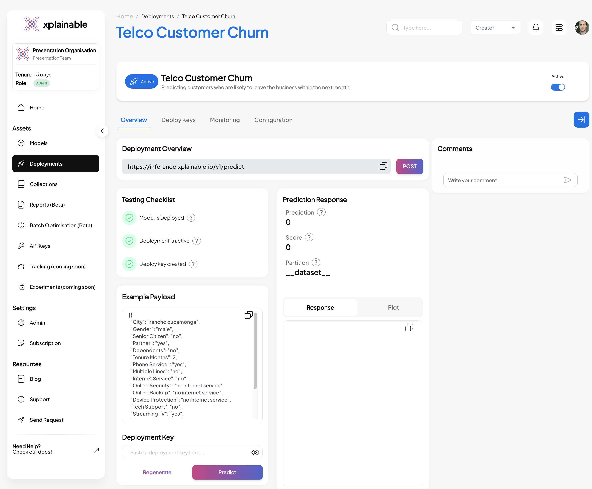

import CellOutput from "../../src/components/CellOutput.jsx";
import LinkButtons from "../../src/components/LinkButtons.jsx";

<LinkButtons
  githubUrl="https://github.com/xplainable/xplainable/blob/main/examples/Telco_Churn.ipynb"
  colabUrl="https://colab.research.google.com/github/xplainable/xplainable/blob/main/examples/Telco_Churn.ipynb"
/>

## Package Imports


```python
import pandas as pd
import xplainable as xp
from xplainable.core.models import XClassifier
from xplainable.core.optimisation.bayesian import XParamOptimiser
from xplainable.preprocessing.pipeline import XPipeline
from xplainable.preprocessing import transformers as xtf
from sklearn.model_selection import train_test_split
import requests
```

## Instantiate Xplainable Cloud

Initialise the xplainable cloud using an API key from: https://beta.xplainable.io/

This allows you to save and collaborate on models, create deployments, create shareable
reports.


```python
xp.initialise(
    api_key="", #<- Add your own token here
)
```

<CellOutput>
{`VBox(children=(VBox(children=(HBox(children=(HBox(children=(Output(), HTML(value='\n        <span style="font-…`}
</CellOutput>

## Read IBM Telco Churn Dataset


```python
df = pd.read_excel('./data/Telco_customer_churn.xlsx')
```

### Sample of the IBM Telco Churn Dataset


```python
df.head()
```


|    | CustomerID   |   Count | Country       | State      | City        |   Zip Code | Lat Long               |   Latitude |   Longitude | Gender   | ...   | Contract       | Paperless Billing   | Payment Method            |   Monthly Charges |   Total Charges | Churn Label   |   Churn Value |   Churn Score |   CLTV | Churn Reason                  |
|---:|:-------------|--------:|:--------------|:-----------|:------------|-----------:|:-----------------------|-----------:|------------:|:---------|:------|:---------------|:--------------------|:--------------------------|------------------:|----------------:|:--------------|--------------:|--------------:|-------:|:------------------------------|
|  0 | 3668-QPYBK   |       1 | United States | California | Los Angeles |      90003 | 33.964131, -118.272783 |    33.9641 |    -118.273 | Male     | ...   | Month-to-month | Yes                 | Mailed check              |             53.85 |          108.15 | Yes           |             1 |            86 |   3239 | Competitor made better offer  |
|  1 | 9237-HQITU   |       1 | United States | California | Los Angeles |      90005 | 34.059281, -118.30742  |    34.0593 |    -118.307 | Female   | ...   | Month-to-month | Yes                 | Electronic check          |             70.7  |          151.65 | Yes           |             1 |            67 |   2701 | Moved                         |
|  2 | 9305-CDSKC   |       1 | United States | California | Los Angeles |      90006 | 34.048013, -118.293953 |    34.048  |    -118.294 | Female   | ...   | Month-to-month | Yes                 | Electronic check          |             99.65 |          820.5  | Yes           |             1 |            86 |   5372 | Moved                         |
|  3 | 7892-POOKP   |       1 | United States | California | Los Angeles |      90010 | 34.062125, -118.315709 |    34.0621 |    -118.316 | Female   | ...   | Month-to-month | Yes                 | Electronic check          |            104.8  |         3046.05 | Yes           |             1 |            84 |   5003 | Moved                         |
|  4 | 0280-XJGEX   |       1 | United States | California | Los Angeles |      90015 | 34.039224, -118.266293 |    34.0392 |    -118.266 | Male     | ...   | Month-to-month | Yes                 | Bank transfer (automatic) |            103.7  |         5036.3  | Yes           |             1 |            89 |   5340 | Competitor had better devices |

## 1. Data Preprocessing


### Turn Label into Binary input


```python
df["Churn Label"] = df["Churn Label"].map({"Yes":1,"No":0})
```

```python
#Instantiate a Pipeline
pipeline = XPipeline()

# Add stages for specific features
pipeline.add_stages([
    {"transformer": xtf.ChangeCases(
        columns=['City', 'Gender', 'Senior Citizen', 'Partner', 'Dependents',
       'Phone Service', 'Multiple Lines', 'Internet Service',
       'Online Security', 'Online Backup', 'Device Protection', 'Tech Support',
       'Streaming TV', 'Streaming Movies', 'Contract', 'Paperless Billing',
       'Payment Method'], case="lower")},
    {"feature":"City","transformer": xtf.Condense(pct=0.25)}, #-> Automatically condense extremely long tail values, to check if latent information
    {"feature":"Monthly Charges", "transformer": xtf.SetDType(to_type="float")}, #-> Turn values into float
    {"transformer": xtf.DropCols(
        columns=['CustomerID', #-> Highly Cardinal, 
                 "Total Charges", #-> Reduce Multicollinearity between Tenure and Monthly Costs
                 'Count', #-> Only one value
                 "Country", #-> Only one value
                 "State", #-> Only one value,
                 "Zip Code", #-> Highly Cardinal and Data Leakage if you keep City
                 "Lat Long", #-> Highly Cardinal
                 "Latitude", #-> Highly Cardinal
                 "Longitude", #-> Highly Cardinal
                 "Churn Value", #-> Data Leakage
                 "Churn Score", #-> Data Leakage
                 "CLTV", #-> Data Leakage
                 "Churn Reason", #-> Data Leakage
                ]
    )},
])
```

<CellOutput>
{`<xplainable.preprocessing.pipeline.XPipeline at 0x1065660d0>`}
</CellOutput>

### Preprocessed data


```python
df_transformed = pipeline.fit_transform(df)
df_transformed.head()
```


|    | City        | Gender   | Senior Citizen   | Partner   | Dependents   |   Tenure Months | Phone Service   | Multiple Lines   | Internet Service   | Online Security   | Online Backup   | Device Protection   | Tech Support   | Streaming TV   | Streaming Movies   | Contract       | Paperless Billing   | Payment Method            |   Monthly Charges |   Churn Label |
|---:|:------------|:---------|:-----------------|:----------|:-------------|----------------:|:----------------|:-----------------|:-------------------|:------------------|:----------------|:--------------------|:---------------|:---------------|:-------------------|:---------------|:--------------------|:--------------------------|------------------:|--------------:|
|  0 | los angeles | male     | no               | no        | no           |               2 | yes             | no               | dsl                | yes               | yes             | no                  | no             | no             | no                 | month-to-month | yes                 | mailed check              |             53.85 |             1 |
|  1 | los angeles | female   | no               | no        | yes          |               2 | yes             | no               | fiber optic        | no                | no              | no                  | no             | no             | no                 | month-to-month | yes                 | electronic check          |             70.7  |             1 |
|  2 | los angeles | female   | no               | no        | yes          |               8 | yes             | yes              | fiber optic        | no                | no              | yes                 | no             | yes            | yes                | month-to-month | yes                 | electronic check          |             99.65 |             1 |
|  3 | los angeles | female   | no               | yes       | yes          |              28 | yes             | yes              | fiber optic        | no                | no              | yes                 | yes            | yes            | yes                | month-to-month | yes                 | electronic check          |            104.8  |             1 |
|  4 | los angeles | male     | no               | no        | yes          |              49 | yes             | yes              | fiber optic        | no                | yes             | yes                 | no             | yes            | yes                | month-to-month | yes                 | bank transfer (automatic) |            103.7  |             1 |

### Create preprocessor ID to persist to Xplainable Cloud


```python
preprocessor_id = xp.client.create_preprocessor_id(
    preprocessor_name="Telco Churn Preprocessing",
    preprocessor_description="Handling all preprocessing steps in the IBM Telco Churn Dataset",
)
preprocessor_id
```

<CellOutput>
{`'HyfDRWw1ZK2e0WJN'`}
</CellOutput>

### Link a preprocessor version to the ID


**Note:** Turn the Pipeline object into a preprocessor object. We're building out the
functionality to persist the pipeline object directly. It's also possible to run the
following code to view the GUI which is currently in Beta:

```python
pp.preprocessor(df)
```


**Note:** Turn the Pipeline object into a preprocessor object. We're building out the
functionality to persist the pipeline object directly. It's also possible to run the
following code to view the GUI which is currently in Beta:

```python
pp.preprocessor(df)
```


```python
preprocessor_version = xp.client.create_preprocessor_version(
    preprocessor_id, #preprocessor_id,
    pipeline, # <-- Pass the pipeline
    df # <-- Pass the raw dataframe
)

preprocessor_version
```

<CellOutput>
{`{'version_id': 'aMdNQFwofZGZHP9n'}`}
</CellOutput>

### Loading the Preprocessor steps

Use the api to load pre-existing preprocessor steps from the xplainable cloud and
transform data inplace.


```python
pp_cloud = xp.client.load_preprocessor(
    preprocessor_id,
    preprocessor_version["version_id"],
    gui_object=False # Set to true to load the GUI object, keep as False for pipeline
    )
```

```python
pp_cloud.stages
```

<CellOutput>
{`[{'feature': '__dataset__',
  'name': 'ChangeCases',
  'transformer': <xplainable.preprocessing.transformers.dataset.ChangeCases at 0x102a89bb0>},
 {'feature': 'City',
  'name': 'Condense',
  'transformer': <xplainable.preprocessing.transformers.categorical.Condense at 0x2a6ec7c70>},
 {'feature': 'Monthly Charges',
  'name': 'SetDType',
  'transformer': <xplainable.preprocessing.transformers.mixed.SetDType at 0x2a6ec7b50>},
 {'feature': '__dataset__',
  'name': 'DropCols',
  'transformer': <xplainable.preprocessing.transformers.dataset.DropCols at 0x2a6ec7520>}]`}
</CellOutput>

```python
df_transformed_cloud = pp_cloud.transform(df)
```

### Create Train/Test split for model training validation


```python
X, y = df_transformed_cloud.drop(columns=['Churn Label']), df['Churn Label']

X_train, X_test, y_train, y_test = train_test_split(
     X, y, test_size=0.33, random_state=42)
```

## 2. Model Optimisation

The `XParamOptimiser` is utilised to fine-tune the hyperparameters of our model. This
process searches for the optimal parameters that will yield the best model performance,
balancing accuracy and computational efficiency.


```python
opt = XParamOptimiser()
params = opt.optimise(X_train, y_train)
```

<CellOutput>
{`100%|████████| 30/30 [00:03<00:00,  9.44trial/s, best loss: -0.8268936134101414]`}
</CellOutput>

## 3. Model Training

With the optimised parameters obtained, the `XClassifier` is trained on the dataset.
This classifier undergoes a fitting process with the training data, ensuring that it
learns the underlying patterns and can make accurate predictions.


```python
model = XClassifier(**params)
model.fit(X_train, y_train)
```

<CellOutput>
{`<xplainable.core.ml.classification.XClassifier at 0x2abcac100>`}
</CellOutput>

## 4. Model Interpretability and Explainability

Following training, the `model.explain()` method is called to generate insights into the
model's decision-making process. This step is crucial for understanding the factors that
influence the model's predictions and ensuring that the model's behaviour is transparent
and explainable.


```python
model.explain()
```

<iframe src='/plot_data/AltairPlot_8372ebb8-6fee-4dc8-8777-9bdb0b3e82cf.html' width='100%' height='520'></iframe>

The image displays two graphs related to a churn prediction model.

On the left is the 'Feature Importances' bar chart, which ranks the features by their
ability to predict customer churn. 'Tenure Months' has the highest importance,
confirming that the length of customer engagement is the most significant indicator of
churn likelihood. 'Monthly Charges' and 'Contract' follow, suggesting that financial and
contractual commitments are also influential in churn prediction.

The right graph is a 'Contributions' histogram, which quantifies the impact of a
specific feature's values on the prediction outcome. The red bars indicate that higher
values within the selected feature correspond to a decrease in the likelihood of churn,
whereas the green bars show that lower values increase this likelihood.

The placement of 'Gender' at the bottom of the 'Feature Importances' chart conclusively
indicates that the model does not consider gender a determinant in predicting churn,
thereby ensuring the model's impartiality regarding gender.


## 5. Model Persisting

In this step, we first create a unique identifier for our churn prediction model using
`xp.client.create_model_id`. This identifier, shown as `model_id`, represents the newly
instantiated model which predicts the likelihood of customers leaving within the next
month. Following this, we generate a specific version of the model with
`xp.client.create_model_version`, passing in our training data. The output `version_id`
represents this particular iteration of our model, allowing us to track and manage
different versions systematically.


```python
model_id = xp.client.create_model_id(
    model,
    model_name="Telco Customer Churn",
    model_description='Predicting customers who are likely to leave the business within the next month.'
)
model_id
```

<CellOutput>
{`'CxdKyfllkLMKQYT9'`}
</CellOutput>

```python
version_id = xp.client.create_model_version(
    model,
    model_id,
    X_train,
    y_train
)
version_id
```

<CellOutput>
{`  0%|          | 0/19 [00:00<?, ?it/s]
'3RmCOzUFTtBi5uVX'`}
</CellOutput>

### SaaS Models View


### SaaS Explainer View


## 6. Model Deployment


The code block illustrates the deployment of our churn prediction model using the
`xp.client.deploy` function. The deployment process involves specifying the `hostname`
of the server where the model will be hosted, as well as the unique `model_id` and
`version_id` that we obtained in the previous steps. This step effectively activates the
model's endpoint, allowing it to receive and process prediction requests. The output
confirms the deployment with a `deployment_id`, indicating the model's current `status`
as 'inactive', its `location`, and the `endpoint` URL where it can be accessed for
xplainable deployments.


```python
deployment = xp.client.deploy(
    hostname="https://inference.xplainable.io", #<- Can set up deployments to be hosted on-prem
    model_id=model_id, #<- Use model id produced above
    version_id=version_id #<- Use version id produced above
)
```

### SaaS Deployment View


### Testing the Deployment programatically

This section demonstrates the steps taken to programmatically test a deployed model.
These steps are essential for validating that the model's deployment is functional and
ready to process incoming prediction requests.


1. **Activating the Deployment:** The model deployment is activated using
   `xp.client.activate_deployment`, which changes the deployment status to active,
   allowing it to accept prediction requests.


```python
xp.client.activate_deployment(deployment['deployment_id'])
```

<CellOutput>
{`{'message': 'activated deployment'}`}
</CellOutput>

2. **Creating a Deployment Key:** A deployment key is generated with
   `xp.client.generate_deploy_key`. This key is required to authenticate and make secure
   requests to the deployed model.


```python
deploy_key = xp.client.generate_deploy_key('for testing', deployment['deployment_id'], 7, clipboard=False)
```

3. **Generating Example Payload:** An example payload for a deployment request is
   generated by `xp.client.generate_example_deployment_payload`. This payload mimics the
   input data structure the model expects when making predictions.


```python
#Set the option to highlight multiple ways of creating data
option = 1
```

```python
if option == 1:
    body = xp.client.generate_example_deployment_payload(deployment['deployment_id'])
else:
    body = json.loads(df_transformed.drop(columns=["Churn Label"]).sample(1).to_json(orient="records"))
    body[0]["Gender"] = None #<- Won't require this line the next release of xplainable
```

```python
body
```

<CellOutput>
{`[{'City': 'other',
  'Gender': 'male',
  'Senior Citizen': 'yes',
  'Partner': 'no',
  'Dependents': 'yes',
  'Tenure Months': 71.5,
  'Phone Service': 'no',
  'Multiple Lines': 'no',
  'Internet Service': 'dsl',
  'Online Security': 'no internet service',
  'Online Backup': 'yes',
  'Device Protection': 'no',
  'Tech Support': 'yes',
  'Streaming TV': 'yes',
  'Streaming Movies': 'no',
  'Contract': 'month-to-month',
  'Paperless Billing': 'yes',
  'Payment Method': 'bank transfer (automatic)',
  'Monthly Charges': None}]`}
</CellOutput>

4. **Making a Prediction Request:** A POST request is made to the model's prediction
   endpoint with the example payload. The model processes the input data and returns a
   prediction response, which includes the predicted class (e.g., 'No' for no churn) and
   the prediction probabilities for each class.


```python
response = requests.post(
    url="https://inference.xplainable.io/v1/predict",
    headers={'api_key': deploy_key['deploy_key']},
    json=body
)

value = response.json()
value
```

<CellOutput>
{`[{'index': 0,
  'id': None,
  'partition': '__dataset__',
  'score': 0.3928926246322737,
  'proba': 0.11276893943031227,
  'pred': '0',
  'support': 303,
  'breakdown': {'base_value': 0.2602797795676134,
   'City': -0.0004814338695100573,
   'Gender': -7.276610831867163e-05,
   'Senior Citizen': 0.045826964522160306,
   'Partner': 0.022065879046674532,
   'Dependents': -0.01868614293728342,
   'Tenure Months': -0.019222955135197697,
   'Phone Service': -0.003697016407864983,
   'Multiple Lines': -0.0014877658362602538,
   'Internet Service': -0.007278086066799008,
   'Online Security': -0.017775137133722977,
   'Online Backup': -0.0046493037837984,
   'Device Protection': 0.0422769557287958,
   'Tech Support': -0.009955151311174023,
   'Streaming TV': 0.011069611702865327,
   'Streaming Movies': 0.024447731368512055,
   'Contract': 0.05457342511379243,
   'Paperless Billing': 0.024703763630477254,
   'Payment Method': -0.009045727458687864,
   'Monthly Charges': 0.0}}]`}
</CellOutput>

## SaaS Deployment Info

The SaaS application interface displayed above mirrors the operations performed
programmatically in the earlier steps. It displays a dashboard for managing the 'Telco
Customer Churn' model, facilitating a range of actions from deployment to testing, all
within a user-friendly web interface. This makes it accessible even to non-technical
users who prefer to manage model deployments and monitor performance through a graphical
interface rather than code. Features like the deployment checklist, example payload, and
prediction response are all integrated into the application, ensuring that users have
full control and visibility over the deployment lifecycle and model interactions.





## 7. Batch Optimisation (Beta)

The concept of Batch Optimization within the Xplainable platform represents a
significant leap forward from traditional machine learning approaches. Moving away from
the prediction -> monitor model approach, this feature offers a dynamic and
cost-effective utilisation of model insights.

This optimisation approach allows for the association of monetary costs with various
predictive scores. It provides a detailed understanding of the financial impact of
different predictive outcomes. For example, within our Telco model, the choice to
provide tech support carries a different cost implication than opting against it,
influencing the decision-making process.

Features may be fixed or adjustable to align with business requirements. Certain
attributes like 'Senior Citizen', 'Tenure', and 'Monthly Charges' may be set due to
regulatory standards or business limitations, ensuring that optimisation adheres to
these rules.

Conversely, features such as 'Streaming Movies' or 'Device Protection' are modifiable,
enabling the exploration of various combinations to discover the most cost-effective
approach. The model could assess if altering the contract type for specific customer
segments improves retention without markedly raising costs.

Employing the Xplainable model's output in this manner allows organisations to extend
past simple predictions to genuine cost optimisation, facilitating strategic
decision-making that evaluates each recommended action not only for its impact on
outcomes like churn but also for cost-efficiency. Thus, Xplainable's strategy provides
businesses the capability to optimise their resources with foresight rarely seen in
traditional machine learning.

